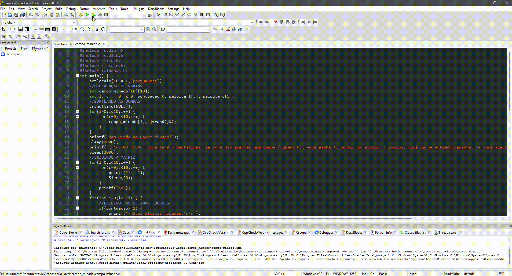

<h1>Campo Minado em C</h1>

Um joguinho de campo minado desenvolvido em C com objetivo de, ao informar uma linha e coluna, não selecionar uma bomba aleatória. A cada acerto, mais 1 ponto e, ao atingir 5 pontos, o usuário vence o jogo.

<h2>Demonstração do programa</h2>

  

<h2>Tecnologias utilizadas</h2>
<ul>
  <li>C
  <li>Code::Blocks - Versão: 20.03
</ul>

<h2>Depedências</h2>
<ul>
  <li>Compilador GCC (ou IDE Code::Blocks);
  <li>Bibliotecas:
    <ul>
      <li>stdio.h
      <li>stdlib.h
      <li>locale.h
      <li>time.h
      <li>windows.h
    </ul>
</ul>

<h2>Como rodar o projeto</h2>
<ul>
  <li>Pelo Code::Blocks:
    <ol>
      <li>Navegue até o diretório pretendido:      
        <pre><code>cd caminho\do\diretorio</code></pre>
      <li>No diretório escolhido, clone o repositório:
        <pre><code>git clone https://github.com/MatheusVenturaNellessen/minefield.git</code></pre>
      <li>Abra o Code::Blocks.
      <li>Vá em <strong>File > Open</strong> e selecione o arquivo <strong>campo_minado.cbp</strong>.
      <li>Clique em <strong>Build and Run</strong> para compilar e executar o jogo.
    </ol>
  <li>Pelo Terminal:</li>
  
É necessário possuir o GCC instalado!

    <ol>
      <li>Abra o terminal.
      <li>Navegue até o diretório pretendido:
        <pre><code>cd caminho\do\diretorio</code></pre>
      <li>No diretório escolhido, clone o repositório:
        <pre><code>git clone https://github.com/MatheusVenturaNellessen/minefield.git</code></pre>
      <li>Compile o código com GCC:
        <pre><code>gcc campo-minado.c -o campo-minado</code></pre>
      <li>Execute o programa compilado:
       <ul>
         <li>Windows:
          <pre><code>campo_minado.exe</code></pre>
        <li>Linux/macOS:
          <pre><code>./campo_minado</code></pre>
      </ul>
</ul>

<h2>Problemas encontrados</h2>
<ol>
  <li>Erro no compilador (no Code::Blocks)
    <ul>
      <li>Solução: Com a IDE aberta, clique em <strong>Settings > Compiler</strong>, irá abrir um menu, em <strong>Global compiler settings</strong> em <strong>Select compiler</strong> selecione a opção <strong>GNU GCC Compiler</strong> (caso não esteja), após clique em <strong>Reset defaults > Sim > Sim > Ok</strong>.
    </ul>
</ol>

<h2>Contribuições</h2>

Este projeto está aberto para contribuições através de issues. Caso você tenha encontrado um bug, queira sugerir uma melhoria ou tenha dúvidas sobre o funcionamento do projeto, por favor, siga as instruções abaixo:

<ol>
    <li>Verifique se já existe uma issue da situação aberta. Se já existir, adicione seu comentário na issue existente.
    <li>Caso não tenha sido aberta, crie uma issue nova.
</ol>
